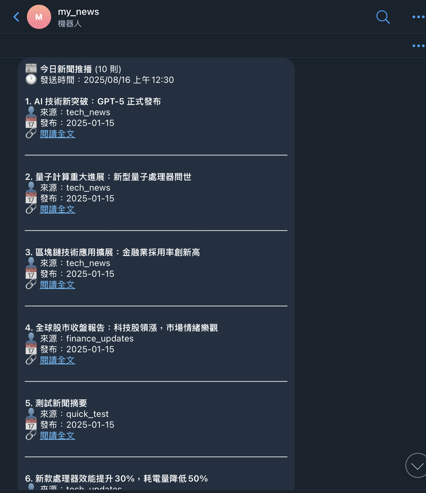
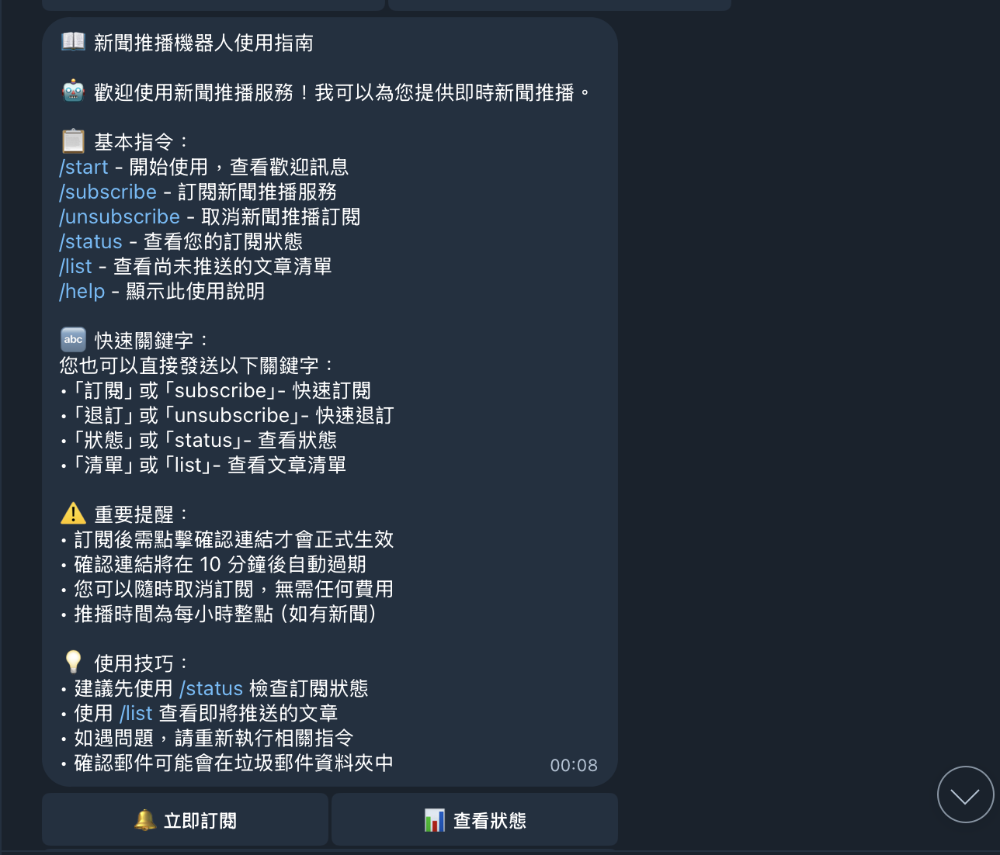
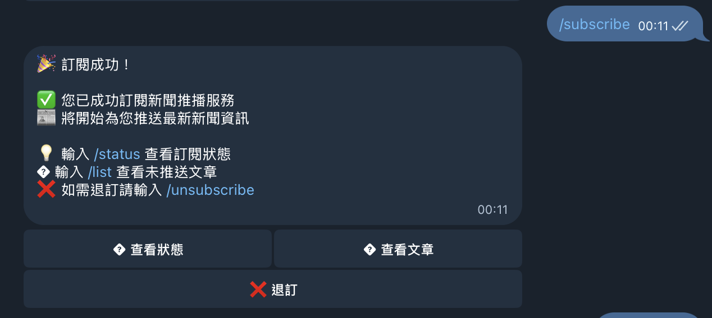

# Telegram 新聞推播機器人

一個基於 Cloudflare Workers 的智能新聞推播系統，提供即時新聞訂閱與推播服務。

## 🤖 機器人功能

### 📱 畫面截圖

以下為本系統主要功能操作畫面截圖：

### 📱 畫面截圖

以下為本系統主要功能操作畫面截圖：

### 📱 畫面截圖

以下為本系統主要功能操作畫面截圖：

|          機器人啟動與歡迎畫面          |          訂閱新聞推播操作          |          API 測試與推播結果          |
| :------------------------------------: | :--------------------------------: | :----------------------------------: |
|  |  |  |

### 📱 私人聊天功能

#### 基本指令

- `/start` - 開始使用，查看歡迎訊息和快速操作選單
- `/help` - 顯示詳細使用說明和指令列表
- `/subscribe` - 訂閱新聞推播服務（直接確認，無需驗證）
- `/unsubscribe` - 取消新聞推播訂閱
- `/status` - 查看當前訂閱狀態和統計資訊
- `/list` - 查看尚未推送的文章清單

#### 快速關鍵字

用戶也可以直接發送以下關鍵字：

- 「訂閱」、「subscribe」- 快速訂閱
- 「退訂」、「unsubscribe」- 快速退訂
- 「狀態」、「status」- 查看狀態

### 🏢 群組功能

#### 一般成員指令

@this_news_bot 是該機器人名字，請換成自己的

- `/start@this_news_bot` - 查看群組歡迎訊息
- `/help@this_news_bot` - 顯示群組使用指南

#### 👑 管理員專用指令

- `/groupsettings@this_news_bot` - 開啟群組管理面板
- `/groupinfo@this_news_bot` - 檢視群組資訊與機器人狀態

#### 群組管理功能

- **訂閱管理** - 為整個群組訂閱新聞推播
- **推播設定** - 調整推播時間、頻率和格式
- **成員管理** - 檢視群組成員狀態和權限
- **統計資訊** - 查看群組使用統計和推播記錄

---

## 📡 API 文檔

### 🧪 手動測試推播 API

#### 端點資訊

- **URL**: `POST /api/test`
- **驗證**: 需要 `X-API-Key` 標頭
- **內容類型**: `application/json`
- **功能**: 手動觸發推播任務執行

#### 使用範例

```bash
curl -X POST \
  -H "Content-Type: application/json" \
  -H "X-API-Key: YOUR_API_KEY_HERE" \
  https://你的子域名.workers.dev/api/test
```

#### 成功回應 (200)

```json
{
	"ok": true,
	"message": "推播任務執行完成",
	"execution_time": 1234,
	"stats": {
		"processed_posts": 2,
		"total_messages": 1,
		"successful_sends": 1,
		"failed_sends": 0,
		"skipped_posts": 0,
		"execution_time": 987
	},
	"timestamp": "2025-08-15T14:30:00.000Z"
}
```

#### 錯誤回應

**系統狀態檢查失敗 (500)**

```json
{
	"ok": false,
	"error": "推播系統狀態檢查失敗",
	"message": "系統不在可執行狀態，請檢查配置",
	"execution_time": 123,
	"timestamp": "2025-08-15T14:30:00.000Z"
}
```

**API 金鑰錯誤 (401)**

```json
{
	"ok": false,
	"error": "未授權的請求",
	"message": "缺少或無效的 API 金鑰"
}
```

### 🔌 新聞資料接收 API

#### 端點資訊

- **URL**: `POST /api/ingest`
- **驗證**: 需要 `X-API-Key` 標頭
- **內容類型**: `application/json`

#### 請求格式

```json
{
	"date": "2025-01-15",
	"results": [
		{
			"username": "news_source_1",
			"start": "2025-01-15",
			"end": "2025-01-16",
			"posts": [
				{
					"post_date": "2025-01-15",
					"summary": "這是一條重要新聞的摘要，最多 1000 個字元",
					"url": "https://example.com/news/123",
					"get_date": "2025-01-15"
				}
			]
		}
	]
}
```

#### 欄位說明

| 欄位                 | 類型   | 必填 | 說明                                      |
| -------------------- | ------ | ---- | ----------------------------------------- |
| `date`               | string | ✅   | 資料日期，格式：YYYY-MM-DD                |
| `results`            | array  | ✅   | 新聞來源結果陣列                          |
| `results[].username` | string | ✅   | 新聞來源使用者名稱                        |
| `results[].start`    | string | ❌   | 活動開始日期，格式：YYYY-MM-DD            |
| `results[].end`      | string | ❌   | 活動結束日期，格式：YYYY-MM-DD            |
| `results[].posts`    | array  | ✅   | 新聞貼文陣列（不可為空）                  |
| `posts[].post_date`  | string | ✅   | 新聞發布日期，格式：YYYY-MM-DD            |
| `posts[].summary`    | string | ✅   | 新聞摘要（最多 1000 字元）                |
| `posts[].url`        | string | ✅   | 新聞連結（最多 500 字元，必須為有效 URL） |
| `posts[].get_date`   | string | ✅   | 資料擷取日期，格式：YYYY-MM-DD            |

#### 回應格式

**成功回應 (200)**

```json
{
	"ok": true,
	"inserted": 5,
	"updated": 2,
	"skipped": 1,
	"details": ["處理來源 news_source_1 時發生警告: 重複的新聞被跳過"]
}
```

**錯誤回應 (400/401/500)**

```json
{
	"ok": false,
	"error": "請求資料格式無效",
	"details": ["results[0]: 缺少必要欄位 posts", "results[0].posts[0]: summary 長度不能超過 1000 個字元"]
}
```

#### 狀態碼說明

| 狀態碼 | 說明               |
| ------ | ------------------ |
| 200    | 請求成功處理       |
| 400    | 請求格式錯誤       |
| 401    | API 金鑰無效或缺失 |
| 500    | 伺服器內部錯誤     |

---

## 🖥️ API 使用範例

### cURL

```bash
curl -X POST https://你的子域名.workers.dev/api/ingest \
  -H "Content-Type: application/json" \
  -H "X-API-Key: YOUR_API_KEY_HERE" \
  -d '{
    "date": "2025-01-15",
    "results": [
      {
        "username": "tech_news",
        "start": "2025-01-15",
        "posts": [
          {
            "post_date": "2025-01-15",
            "summary": "AI 技術新突破：GPT-5 正式發布",
            "url": "https://example.com/ai-news-gpt5",
            "get_date": "2025-01-15"
          },
          {
            "post_date": "2025-01-15",
            "summary": "量子計算重大進展：新型量子處理器問世",
            "url": "https://example.com/quantum-computing",
            "get_date": "2025-01-15"
          }
        ]
      }
    ]
  }'
```

### JavaScript / Node.js

```javascript
const fetch = require('node-fetch'); // npm install node-fetch

async function ingestNews() {
	const newsData = {
		date: '2025-01-15',
		results: [
			{
				username: 'tech_news',
				start: '2025-01-15',
				posts: [
					{
						post_date: '2025-01-15',
						summary: 'AI 技術新突破：GPT-5 正式發布',
						url: 'https://example.com/ai-news-gpt5',
						get_date: '2025-01-15',
					},
				],
			},
		],
	};

	try {
		const response = await fetch('https://你的子域名.workers.dev/api/ingest', {
			method: 'POST',
			headers: {
				'Content-Type': 'application/json',
				'X-API-Key': 'YOUR_API_KEY_HERE',
			},
			body: JSON.stringify(newsData),
		});

		const result = await response.json();

		if (result.ok) {
			console.log('新聞推送成功！');
			console.log(`新增: ${result.inserted}, 更新: ${result.updated}, 跳過: ${result.skipped}`);
		} else {
			console.error('推送失敗:', result.error);
			if (result.details) {
				result.details.forEach((detail) => console.error('- ' + detail));
			}
		}
	} catch (error) {
		console.error('網路錯誤:', error);
	}
}

ingestNews();
```

### Python

```python
import requests
import json
from datetime import datetime

def ingest_news():
    url = 'https://你的子域名.workers.dev/api/ingest'

    headers = {
        'Content-Type': 'application/json',
        'X-API-Key': 'YOUR_API_KEY_HERE'
    }

    news_data = {
        'date': '2025-01-15',
        'results': [
            {
                'username': 'tech_news',
                'start': '2025-01-15',
                'posts': [
                    {
                        'post_date': '2025-01-15',
                        'summary': 'AI 技術新突破：GPT-5 正式發布',
                        'url': 'https://example.com/ai-news-gpt5',
                        'get_date': '2025-01-15'
                    },
                    {
                        'post_date': '2025-01-15',
                        'summary': '量子計算重大進展：新型量子處理器問世',
                        'url': 'https://example.com/quantum-computing',
                        'get_date': '2025-01-15'
                    }
                ]
            }
        ]
    }

    try:
        response = requests.post(url, headers=headers, json=news_data)
        result = response.json()

        if result['ok']:
            print('新聞推送成功！')
            print(f'新增: {result["inserted"]}, 更新: {result["updated"]}, 跳過: {result["skipped"]}')
        else:
            print(f'推送失敗: {result["error"]}')
            if 'details' in result:
                for detail in result['details']:
                    print(f'- {detail}')

    except requests.exceptions.RequestException as e:
        print(f'網路錯誤: {e}')
    except json.JSONDecodeError:
        print('回應格式錯誤')

if __name__ == '__main__':
    ingest_news()
```

### PHP

```php
<?php
function ingestNews() {
    $url = 'https://你的子域名.workers.dev/api/ingest';

    $headers = [
        'Content-Type: application/json',
        'X-API-Key: YOUR_API_KEY_HERE'
    ];

    $newsData = [
        'date' => '2025-01-15',
        'results' => [
            [
                'username' => 'tech_news',
                'start' => '2025-01-15',
                'posts' => [
                    [
                        'post_date' => '2025-01-15',
                        'summary' => 'AI 技術新突破：GPT-5 正式發布',
                        'url' => 'https://example.com/ai-news-gpt5',
                        'get_date' => '2025-01-15'
                    ]
                ]
            ]
        ]
    ];

    $ch = curl_init();
    curl_setopt($ch, CURLOPT_URL, $url);
    curl_setopt($ch, CURLOPT_POST, true);
    curl_setopt($ch, CURLOPT_POSTFIELDS, json_encode($newsData));
    curl_setopt($ch, CURLOPT_HTTPHEADER, $headers);
    curl_setopt($ch, CURLOPT_RETURNTRANSFER, true);

    $response = curl_exec($ch);
    $httpCode = curl_getinfo($ch, CURLINFO_HTTP_CODE);
    curl_close($ch);

    $result = json_decode($response, true);

    if ($result['ok']) {
        echo "新聞推送成功！\n";
        echo "新增: {$result['inserted']}, 更新: {$result['updated']}, 跳過: {$result['skipped']}\n";
    } else {
        echo "推送失敗: {$result['error']}\n";
        if (isset($result['details'])) {
            foreach ($result['details'] as $detail) {
                echo "- $detail\n";
            }
        }
    }
}

ingestNews();
?>
```

### Go

```go
package main

import (
    "bytes"
    "encoding/json"
    "fmt"
    "io/ioutil"
    "net/http"
)

type IngestRequest struct {
    Date    string   `json:"date"`
    Results []Result `json:"results"`
}

type Result struct {
    Username string `json:"username"`
    Start    string `json:"start,omitempty"`
    End      string `json:"end,omitempty"`
    Posts    []Post `json:"posts"`
}

type Post struct {
    PostDate string `json:"post_date"`
    Summary  string `json:"summary"`
    URL      string `json:"url"`
    GetDate  string `json:"get_date"`
}

type IngestResponse struct {
    OK       bool     `json:"ok"`
    Inserted int      `json:"inserted,omitempty"`
    Updated  int      `json:"updated,omitempty"`
    Skipped  int      `json:"skipped,omitempty"`
    Error    string   `json:"error,omitempty"`
    Details  []string `json:"details,omitempty"`
}

func ingestNews() error {
    url := "https://你的子域名.workers.dev/api/ingest"

    newsData := IngestRequest{
        Date: "2025-01-15",
        Results: []Result{
            {
                Username: "tech_news",
                Start:    "2025-01-15",
                Posts: []Post{
                    {
                        PostDate: "2025-01-15",
                        Summary:  "AI 技術新突破：GPT-5 正式發布",
                        URL:      "https://example.com/ai-news-gpt5",
                        GetDate:  "2025-01-15",
                    },
                },
            },
        },
    }

    jsonData, err := json.Marshal(newsData)
    if err != nil {
        return fmt.Errorf("JSON 序列化錯誤: %v", err)
    }

    req, err := http.NewRequest("POST", url, bytes.NewBuffer(jsonData))
    if err != nil {
        return fmt.Errorf("創建請求錯誤: %v", err)
    }

    req.Header.Set("Content-Type", "application/json")
    req.Header.Set("X-API-Key", "YOUR_API_KEY_HERE")

    client := &http.Client{}
    resp, err := client.Do(req)
    if err != nil {
        return fmt.Errorf("請求錯誤: %v", err)
    }
    defer resp.Body.Close()

    body, err := ioutil.ReadAll(resp.Body)
    if err != nil {
        return fmt.Errorf("讀取回應錯誤: %v", err)
    }

    var result IngestResponse
    err = json.Unmarshal(body, &result)
    if err != nil {
        return fmt.Errorf("JSON 解析錯誤: %v", err)
    }

    if result.OK {
        fmt.Printf("新聞推送成功！\n")
        fmt.Printf("新增: %d, 更新: %d, 跳過: %d\n",
            result.Inserted, result.Updated, result.Skipped)
    } else {
        fmt.Printf("推送失敗: %s\n", result.Error)
        for _, detail := range result.Details {
            fmt.Printf("- %s\n", detail)
        }
    }

    return nil
}

func main() {
    if err := ingestNews(); err != nil {
        fmt.Printf("錯誤: %v\n", err)
    }
}
```

### Ruby

```ruby
require 'net/http'
require 'json'
require 'uri'

def ingest_news
  url = URI('https://你的子域名.workers.dev/api/ingest')

  news_data = {
    date: '2025-01-15',
    results: [
      {
        username: 'tech_news',
        start: '2025-01-15',
        posts: [
          {
            post_date: '2025-01-15',
            summary: 'AI 技術新突破：GPT-5 正式發布',
            url: 'https://example.com/ai-news-gpt5',
            get_date: '2025-01-15'
          }
        ]
      }
    ]
  }

  http = Net::HTTP.new(url.host, url.port)
  http.use_ssl = true

  request = Net::HTTP::Post.new(url)
  request['Content-Type'] = 'application/json'
  request['X-API-Key'] = 'YOUR_API_KEY_HERE'
  request.body = news_data.to_json

  begin
    response = http.request(request)
    result = JSON.parse(response.body)

    if result['ok']
      puts '新聞推送成功！'
      puts "新增: #{result['inserted']}, 更新: #{result['updated']}, 跳過: #{result['skipped']}"
    else
      puts "推送失敗: #{result['error']}"
      result['details']&.each { |detail| puts "- #{detail}" }
    end
  rescue Net::HTTPError => e
    puts "網路錯誤: #{e.message}"
  rescue JSON::ParserError => e
    puts "JSON 解析錯誤: #{e.message}"
  end
end

ingest_news
```

---

## �️ API 最佳實踐

### 安全性建議

1. **API 金鑰保護**

   - 將 API 金鑰存放在環境變數中，不要硬編碼
   - 定期輪換 API 金鑰
   - 僅在 HTTPS 連接中使用

2. **請求限制**

   - 實施請求頻率限制
   - 建議批次傳送新聞（一次最多 100 筆）
   - 添加適當的 timeout 設定

3. **錯誤處理**
   - 總是檢查 `ok` 欄位
   - 記錄錯誤訊息供後續分析
   - 實施重試機制處理網路錯誤

---

## 🚀 部署和配置

### 📋 環境變數配置

本系統使用 Cloudflare Workers 秘密變數來安全地管理敏感配置資訊。

#### 🔐 必要的秘密變數

使用以下指令配置 Cloudflare Workers 秘密變數：

```bash
# API 金鑰 - 用於驗證外部 API 請求
wrangler secret put API_KEY

# Telegram Bot Token - 從 @BotFather 取得
wrangler secret put TELEGRAM_BOT_TOKEN


# Telegram Webhook 秘密 - 用於驗證 Telegram webhook 請求
wrangler secret put TELEGRAM_WEBHOOK_SECRET
```

#### 🎯 秘密變數說明

| 秘密變數                  | 說明                | 取得方式                                                 |
| ------------------------- | ------------------- | -------------------------------------------------------- |
| `API_KEY`                 | API 請求驗證金鑰    | 自行生成強密碼（建議 32+ 字元）                          |
| `TELEGRAM_BOT_TOKEN`      | Telegram 機器人權杖 | 從 [@BotFather](https://t.me/botfather) 建立機器人後取得 |
| `TELEGRAM_WEBHOOK_SECRET` | Webhook 驗證秘密    | 自行生成隨機字串（建議 16+ 字元）                        |

#### ⚙️ 生成建議

```bash
# 生成 API_KEY（32 字元隨機字串）
openssl rand -hex 16

# 生成 TELEGRAM_WEBHOOK_SECRET（24 字元隨機字串）
openssl rand -base64 18
```

#### 🛡️ 安全性最佳實踐

1. **永不在程式碼中硬編碼秘密**
2. **定期輪換秘密變數**
3. **使用強隨機密碼生成器**
4. **限制秘密變數存取權限**

#### 📝 部署步驟

1. **配置秘密變數**：

   ```bash
   wrangler secret put API_KEY
   wrangler secret put TELEGRAM_BOT_TOKEN
   wrangler secret put TELEGRAM_WEBHOOK_SECRET
   ```

2. **部署到 Cloudflare Workers**：

   ```bash
   npm run deploy
   ```

3. **設定 Telegram Webhook**：

## 🚀 設定 Telegram Webhook

在設定 webhook 之前，你需要先部署你的 worker 以獲得一個公開可訪問的 URL：

```bash
# 部署到 Cloudflare Workers
wrangler deploy
```

部署成功後，你會獲得一個類似 `https://your-worker.your-subdomain.workers.dev` 的 URL。

首先取得你的 Bot Token 和 Webhook Secret：

```bash
# 查看已設定的 Bot Token（可選）
wrangler secret list
```

然後設定 webhook：

```bash
# 替換 <YOUR_BOT_TOKEN> 為你的實際 Bot Token
# 替換 <YOUR_WEBHOOK_SECRET> 為你設定的 webhook 秘密
# 替換 your-worker.your-subdomain.workers.dev 為你的實際 Worker 網址
# 注意路徑是 /tg/webhook

curl -X POST "https://api.telegram.org/bot<YOUR_BOT_TOKEN>/setWebhook" \
  -H "Content-Type: application/json" \
  -d '{
    "url": "https://your-worker.your-subdomain.workers.dev/tg/webhook",
    "secret_token": "<YOUR_WEBHOOK_SECRET>"
  }'
```

4. **測試機器人功能**：

   設定完成後，在 Telegram 中找到你的機器人並測試：

   ```
   /start
   /help
   /subscribe
   ```

### 🗄️ 資料庫設定

使用 Cloudflare D1 資料庫：

```bash
# 建立資料庫
wrangler d1 create telegram_news_db

# 執行資料庫遷移
wrangler d1 migrations apply telegram_news_db --local
wrangler d1 migrations apply telegram_news_db --remote
```

### 🛠️ 本地開發

```bash
# 安裝依賴
npm install

# 本地開發伺服器
npm run dev

# 執行測試
npm test
```

---

## 🔑 API 金鑰管理

### 環境變數配置範例

```bash
# .env 檔案（僅用於本地測試）
TELEGRAM_NEWS_API_KEY=your_actual_api_key_here
TELEGRAM_NEWS_API_URL=https://你的子域名.workers.dev/api/ingest
```

⚠️ **重要提醒**：生產環境請務必使用 Cloudflare Workers 秘密變數，不要使用 `.env` 檔案。

### 錯誤處理最佳實踐

```javascript
// JavaScript 完整錯誤處理範例
async function safeIngestNews(newsData, maxRetries = 3) {
	const apiKey = process.env.TELEGRAM_NEWS_API_KEY;
	const apiUrl = process.env.TELEGRAM_NEWS_API_URL;

	if (!apiKey) {
		throw new Error('TELEGRAM_NEWS_API_KEY 環境變數未設定');
	}

	for (let attempt = 1; attempt <= maxRetries; attempt++) {
		try {
			const response = await fetch(apiUrl, {
				method: 'POST',
				headers: {
					'Content-Type': 'application/json',
					'X-API-Key': apiKey,
				},
				body: JSON.stringify(newsData),
				timeout: 10000, // 10 秒 timeout
			});

			if (!response.ok) {
				if (response.status === 401) {
					throw new Error('API 金鑰無效，請檢查設定');
				} else if (response.status === 429) {
					// 請求頻率限制，等待後重試
					const waitTime = Math.pow(2, attempt) * 1000; // 指數回退
					console.log(`請求頻率限制，${waitTime}ms 後重試...`);
					await new Promise((resolve) => setTimeout(resolve, waitTime));
					continue;
				}
			}

			const result = await response.json();

			if (!result.ok) {
				console.error('API 錯誤:', result.error);
				if (result.details) {
					result.details.forEach((detail) => console.error('- ' + detail));
				}
				return result;
			}

			console.log('新聞推送成功！', {
				inserted: result.inserted,
				updated: result.updated,
				skipped: result.skipped,
			});

			return result;
		} catch (error) {
			if (attempt === maxRetries) {
				console.error(`最終嘗試失敗 (${maxRetries}/${maxRetries}):`, error.message);
				throw error;
			} else {
				console.warn(`嘗試 ${attempt}/${maxRetries} 失敗，準備重試:`, error.message);
				const waitTime = Math.pow(2, attempt) * 1000;
				await new Promise((resolve) => setTimeout(resolve, waitTime));
			}
		}
	}
}
```

### 資料驗證範例

```python
# Python 資料驗證範例
import re
from datetime import datetime

def validate_news_data(news_data):
    """驗證新聞資料格式"""
    errors = []

    # 驗證日期格式
    date_pattern = r'^\d{4}-\d{2}-\d{2}$'
    if not re.match(date_pattern, news_data.get('date', '')):
        errors.append('date 必須為 YYYY-MM-DD 格式')

    # 驗證 results 陣列
    results = news_data.get('results', [])
    if not results:
        errors.append('results 不能為空陣列')

    for i, result in enumerate(results):
        # 驗證使用者名稱
        if not result.get('username'):
            errors.append(f'results[{i}]: username 為必填欄位')

        # 驗證貼文
        posts = result.get('posts', [])
        if not posts:
            errors.append(f'results[{i}]: posts 不能為空陣列')

        for j, post in enumerate(posts):
            # 驗證摘要長度
            summary = post.get('summary', '')
            if len(summary) > 1000:
                errors.append(f'results[{i}].posts[{j}]: summary 長度超過 1000 字元')

            # 驗證 URL 格式
            url = post.get('url', '')
            if len(url) > 500:
                errors.append(f'results[{i}].posts[{j}]: url 長度超過 500 字元')
            elif not url.startswith(('http://', 'https://')):
                errors.append(f'results[{i}].posts[{j}]: url 必須以 http:// 或 https:// 開頭')

            # 驗證日期
            for date_field in ['post_date', 'get_date']:
                if not re.match(date_pattern, post.get(date_field, '')):
                    errors.append(f'results[{i}].posts[{j}]: {date_field} 必須為 YYYY-MM-DD 格式')

    return errors

# 使用範例
news_data = {...}  # 你的新聞資料
validation_errors = validate_news_data(news_data)

if validation_errors:
    print('資料驗證失敗:')
    for error in validation_errors:
        print(f'- {error}')
else:
    print('資料驗證通過，可以傳送')
    # 呼叫 ingest_news()
```

---

## �📋 Help 指令詳細說明

### 私人聊天 Help 功能

當用戶在私人聊天中使用 `/help` 指令時，機器人會提供：

1. **完整功能介紹** - 詳細說明所有可用功能
2. **指令列表** - 所有基本指令及其用途
3. **關鍵字說明** - 快速操作關鍵字
4. **重要提醒** - 訂閱確認流程和注意事項
5. **使用技巧** - 最佳實務和問題排除建議
6. **互動按鈕** - 快速訂閱、查看狀態等操作

### 群組 Help 功能

@this_news_bot 是該機器人名字，請換成自己的
在群組中使用 `/help@this_news_bot` 時，機器人會根據用戶權限顯示：

#### 一般成員看到的內容：

- 群組使用基本說明
- 個人訂閱管理指引
- 私訊機器人的方法
- 群組使用注意事項

#### 管理員額外看到的內容：

- 管理員專用指令列表
- 群組管理功能說明
- 權限設定提示
- 管理員最佳實務建議

### Help 功能特色

#### 🎯 智能內容適配

- **環境感知** - 自動檢測私人聊天或群組環境
- **權限感知** - 根據用戶權限顯示相應功能
- **動態內容** - 根據情境提供最相關的資訊

#### 🔘 互動式體驗

- **快速操作按鈕** - 直接執行常用功能
- **導航按鈕** - 便於在不同功能間切換
- **關閉選項** - 避免聊天記錄混亂

#### 📖 詳細說明

- **步驟指引** - 詳細的操作步驟說明
- **注意事項** - 重要提醒和限制說明
- **使用技巧** - 提升用戶體驗的建議
- **問題排除** - 常見問題的解決方案

## 🛠️ 技術實作

Help 指令的技術特點：

1. **模組化設計** - 私人聊天和群組功能分離
2. **權限檢查** - 整合群組管理員權限驗證
3. **動態內容** - 根據用戶狀態動態生成內容
4. **錯誤處理** - 完善的異常處理機制
5. **性能優化** - 利用權限快取提升響應速度

## 🔗 相關連結

- 📖 **詳細規格**: [.spec/spec.md](.spec/spec.md)
- 📋 **開發任務**: [.spec/task.md](.spec/task.md)
- 📝 **變更記錄**: [.spec/changelog.md](.spec/changelog.md)
- 🧪 **API 測試案例**: [.spec/api-test.http](.spec/api-test.http)
- 🗂️ **API 文件草稿**: [.spec/api-doc.md](.spec/api-doc.md)
- 🧩 **資料結構設計**: [.spec/schema.md](.spec/schema.md)
- 🛡️ **安全性設計**: [.spec/security.md](.spec/security.md)

---

---

---

## 🗂️ 根目錄 sh/py 工具腳本說明

| 檔案名稱                   | 類型 | 說明                                                                                                                              |
| -------------------------- | ---- | --------------------------------------------------------------------------------------------------------------------------------- |
| `curl-template.sh`         | sh   | API 批次推播測試腳本，直接呼叫 /api/ingest，需設定 API_KEY 與 API_URL，支援多新聞批次推送。 \* 請從 curl-template.example.sh 建立 |
| `curl-template.example.sh` | sh   | API 測試腳本範本，僅供參考，需自行填入 API_KEY 與 API_URL。                                                                       |
| `curl_api_test.sh`         | sh   | /api/test 端點的 cURL 模擬指令腳本，展示 API_KEY 標頭用法與預期回應格式。依照說明手動觸發排程。                                   |
| `debug_subscription.js`    | js   | 訂閱確認流程的調試腳本，模擬訂閱建立與確認，便於本地除錯。                                                                        |
| `test_list_command.js`     | js   | 模擬 Telegram webhook /list 指令測試腳本，驗證 webhook 處理流程。                                                                 |
| `git.py`                   | py   | Git 自動化工具，支援一鍵 add/commit/push，互動式輸入 commit message，適合快速同步專案。                                           |
| `truncate_tables.py`       | py   | D1 資料庫資料表清空工具，互動式選單，可選擇性清空推播記錄、統計等表，適合開發測試重置。                                           |

> 這些腳本主要用於本地開發、測試與維運自動化，請依需求調整參數與權限，避免在生產環境誤用。
